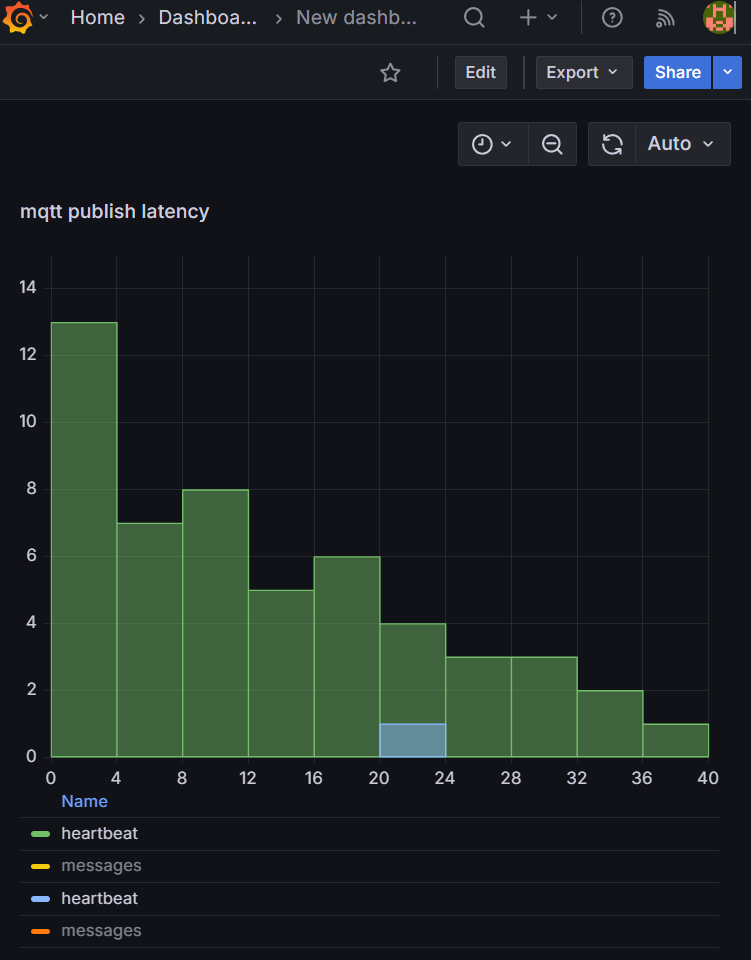

# mqtt-kit
Websocket MQTT bridge demo

### Measures bridge to broker latency


## Heartbeat topic example:


## Messages topic example:


## Metrics

Use http://localhost:8080/actuator/prometheus for prometheus agent/grafana 
```
$ curl http://localhost:8080/actuator/prometheus|grep mqtt
disk_free_bytes{path="mcgill-enterprises/mqtt-kit/."} 2.60163887104E11
disk_total_bytes{path="mcgill-enterprises/mqtt-kit/."} 5.10770802688E11
# HELP mqtt_client_conns MQTT Client connections
# TYPE mqtt_client_conns gauge
mqtt_client_conns{mqtt="client"} 2.0
# HELP mqtt_client_puback_timeouts_total MQTT PUBACK timeouts
# TYPE mqtt_client_puback_timeouts_total counter
mqtt_client_puback_timeouts_total{mqtt="puback"} 0.0
# HELP mqtt_publish_failure_total MQTT Publish Failure
# TYPE mqtt_publish_failure_total counter
mqtt_publish_failure_total{topic="heartbeat"} 0.0
mqtt_publish_failure_total{topic="messages"} 0.0
# HELP mqtt_publish_latency_seconds duration of heartbeat publish
# TYPE mqtt_publish_latency_seconds histogram
mqtt_publish_latency_seconds_bucket{topic="heartbeat",le="0.001"} 241
mqtt_publish_latency_seconds_bucket{topic="heartbeat",le="0.001048576"} 241
mqtt_publish_latency_seconds_bucket{topic="heartbeat",le="0.001398101"} 241
mqtt_publish_latency_seconds_bucket{topic="heartbeat",le="0.001747626"} 241
mqtt_publish_latency_seconds_bucket{topic="heartbeat",le="0.002097151"} 265
mqtt_publish_latency_seconds_bucket{topic="heartbeat",le="0.002446676"} 265
mqtt_publish_latency_seconds_bucket{topic="heartbeat",le="0.002796201"} 265
mqtt_publish_latency_seconds_bucket{topic="heartbeat",le="0.003145726"} 269
mqtt_publish_latency_seconds_bucket{topic="heartbeat",le="0.003495251"} 269
mqtt_publish_latency_seconds_bucket{topic="heartbeat",le="0.003844776"} 269
mqtt_publish_latency_seconds_bucket{topic="heartbeat",le="0.004194304"} 270
mqtt_publish_latency_seconds_bucket{topic="heartbeat",le="0.005"} 271
mqtt_publish_latency_seconds_bucket{topic="heartbeat",le="0.1"} 273
mqtt_publish_latency_seconds_bucket{topic="heartbeat",le="+Inf"} 273
mqtt_publish_latency_seconds_count{topic="heartbeat"} 273
mqtt_publish_latency_seconds_sum{topic="heartbeat"} 0.189
```

